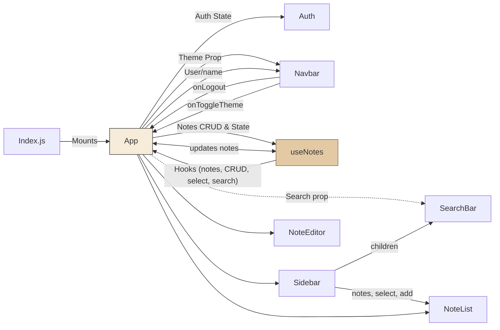

# NoteNest Notes App – Comprehensive Documentation

## Table of Contents
1. [Project Overview](#project-overview)
2. [Product Requirements & Features](#product-requirements--features)
3. [Architecture Overview](#architecture-overview)
    - [Component & Folder Structure](#component--folder-structure)
    - [Architecture Diagram](#architecture-diagram)
4. [Component Responsibilities and Interfaces](#component-responsibilities-and-interfaces)
5. [Theming & Styling Strategy](#theming--styling-strategy)
6. [Authentication Implementation](#authentication-implementation)
7. [Notes CRUD & State Management](#notes-crud--state-management)
8. [Responsive Design & UX Details](#responsive-design--ux-details)
9. [Setup & Running Instructions](#setup--running-instructions)
10. [Test Coverage & Quality](#test-coverage--quality)
11. [Third-Party Resources](#third-party-resources)
12. [Further Notes](#further-notes)

---

## Project Overview

**NoteNest** is a web-based notes application built using React. It features a vintage notebook aesthetic enhanced by glassmorphism, supports theme switching (light/dark), provides simple browser-based user authentication, and stores all notes in localStorage on a per-user basis for privacy and speed. The app is fast, minimal, responsive, and designed with a modern, user-friendly experience.

---

## Product Requirements & Features

**Functional Requirements:**
- Local/browser-based user authentication (name input only)
- CRUD (Create, Read, Update, Delete) operations for notes
- Persistent storage of notes per user in localStorage
- Search functionality across notes by title/content
- Theme switching (light/dark) with thematic color palettes
- Fully responsive and polished UI with a vintage notebook feel, using glassmorphism design patterns
- Fast load, no backend/network dependencies, minimal third-party libraries

**Non-Functional Requirements:**
- Aesthetically pleasing and distinct from typical utilitarian note apps
- Accessibility-aware (contrast, keyboard navigation, focus)
- Code readability and maintainability
- Easy local setup and extensibility

---

## Architecture Overview

NoteNest is a single-page React application. All state and persistence is local (browser localStorage). The application is composed of several modular React components, a custom hook for state and persistence logic, and CSS modules for styling. The structure lends itself to easy understanding and customization.

### Component & Folder Structure

```
/src
  App.js              # Main entry point - orchestrates theme, authentication, and layout
  App.css             # Core theme, layout, and responsive design styles
  index.js            # ReactDOM entry - renders <App />
  index.css           # Baseline typography/styles

  /hooks
    useNotes.js       # Custom hook for notes CRUD & storage

  /components
    Navbar.js         # Top navigation bar (brand, theme toggle, user info/logout)
    Sidebar.js        # Sidebar for note navigation/creation and search
    NoteEditor.js     # Main editing interface for notes
    NoteList.js       # List view for displaying/filtering notes
    SearchBar.js      # Search input for filtering notes
    Auth.js           # User authentication/login (by username)
    *.css             # Component-focused styles
```

_Note_: The folder structure supports a separation of concerns: layout, authentication, note management, theme, and search.

### Architecture Diagram



---

## Component Responsibilities and Interfaces

- **App.js**: Orchestrates state (theme, user, search), initializes and passes note CRUD functions, and controls the main layout flow. Handles theme switching and authentication transitions.
- **Navbar.js**: Displays brand/logo, theme switch toggle, user info, and logout button. Receives theme/user/handlers as props.
- **Sidebar.js**: Renders a notes navigation column, uses children slot for search bar, displays note list, provides note creation interface.
- **NoteEditor.js**: Handles editing, saving, and deleting of the currently selected note; updates note title/content, shows last updated time, focuses title input on note select.
- **NoteList.js**: (For search mode) Displays a list of notes; manages highlighting/selection and note deletion in a list context.
- **SearchBar.js**: Standalone search input; filters notes based on title/content.
- **Auth.js**: Prompt user for a username, validates input, persists successful authentication by writing username to localStorage and invoking parent callback.
- **useNotes.js**: Custom hook encapsulating note CRUD logic and persistence, all using localStorage keyed by user. Returns {notes, activeNote, add, update, delete, select}.

---

## Theming & Styling Strategy

### Glassmorphism & Notebook Inspiration

- The UI is themed after a vintage notebook, featuring *glassmorphism* throughout: soft semi-transparent backgrounds, border radii, and backdrop blurs for containers (see `.glass-container`, `.glassy-navbar`, `.note-editor-glass`).
- Backgrounds include gradients combined with faint horizontal repeating lines, emulating a paper notebook’s lined pages.
- Typography uses Georgia/Times for a subtle handwritten or old book vibe.
- Components layer warm sepia-based colors with gentle accent hues for a welcoming, retro effect.

### Theme Switching

- Theme state is managed in App.js and persisted in localStorage under `noteapp_theme`.
- Two themes: `light` (old notebook paper) and `dark` (sepia/old brown paper).  
- CSS custom properties (`:root` and `[data-theme="dark"]`) drive all color/styling changes, ensuring consistent look and easy extension.

### CSS Organization

- Global theme and layout: `App.css`, `index.css`
- Component-specific appearance: `<Component>.css`
- Uses only vanilla CSS (no external frameworks), easy to customize and extend.

---

## Authentication Implementation

- The authentication flow is implemented entirely client-side and does **not** use remote/bespoke authentication or backend.
- On first load or when not authenticated, users are prompted in `Auth.js` for a name (validated to be non-empty).
- Upon login, the name is persisted as `noteapp_user` in localStorage and `<App>` state is updated.
- Logout simply clears `noteapp_user` and resets notes context.
- Each user’s notes are namespaced separately in localStorage, supporting multi-user use on a single device with isolated notes.

---

## Notes CRUD & State Management

- All note operations are managed with `useNotes.js`, a custom React hook.
- **Storage**: All notes for all users are stored as a nested object in localStorage under `noteapp_notes` `{ [user]: [array of notes] }`.
- **Note Object**: `{ id, title, content, created, updated }`.
- **CRUD Operations**:
    - `createNote()` generates a blank note with a unique ID and sets it as active.
    - `updateNote(note)` updates contents and timestamp.
    - `deleteNote(id)` removes note and updates active/selection.
    - `selectNote(id)` changes the selected note for editing/viewing.
    - `searchNotes(query)` filters by title or content (case-insensitive).
- State updates are synced automatically to localStorage per user.
- Switching users clears visible notes and resets state.

---

## Responsive Design & UX Details

- The layout is built with flexbox, adapting navigation (sidebar) and main content for desktop/tablet/mobile via media queries.
- All main containers (.glass-container, .App-header, etc.) adjust their padding, width, and font size below 900px and 768px for optimal mobile usability.
- The sidebar collapses for narrow screens, focusing on the main editor.
- Touch targets (buttons, toggles) are appropriately sized for both mouse and touch users.
- Glass and blur effects adapt their intensity between themes for visual clarity.
- Accessibility: color contrasts, focus rings, ARIA labels where appropriate, keyboard-navigable inputs.

#### UX Polish Details
- Focus is managed for new notes and editing to allow quick keyboard use.
- Error messages and input validation shown for authentication.
- Hover and active states for all buttons.
- Text area for notes is resizable, supporting longer entries.
- Unicode icons for clarity without reliance on external icon libraries.

---

## Setup & Running Instructions

1. **Clone the Repository:**
    ```bash
    git clone <repository-url>
    cd notenest-107354-b96cb034/notes_frontend
    ```

2. **Install Dependencies:**
    ```bash
    npm install
    ```
   *(Minimal dependencies: React, ReactDOM, React Scripts.)*

3. **Run the Development Server:**
    ```bash
    npm start
    ```
    Open [http://localhost:3000](http://localhost:3000) to view in your browser.

4. **Run Tests:**
    ```bash
    npm test
    ```
    Uses React Testing Library and Jest.

5. **Build for Production:**
    ```bash
    npm run build
    ```
    Outputs to `/build`.

---

## Test Coverage & Quality

- Testing uses [Jest](https://jestjs.io/) and [React Testing Library](https://testing-library.com/).
- `src/setupTests.js` extends matchers and environment for DOM testing.
- `src/App.test.js` includes a simple test verifying React renders the main App component in the DOM.
- Project encourages further component and integration testing to maintain quality.
- ESLint is set up with custom config and React recommendations (`.eslint.config.mjs`), supporting code quality and linting on JS/JSX.

---

## Third-Party Resources

- [React](https://reactjs.org/) (UI)
- [Jest](https://jestjs.io/) (testing)
- [React Testing Library](https://testing-library.com/) (testing)
- [@eslint/js](https://www.npmjs.com/package/@eslint/js) and [eslint-plugin-react](https://www.npmjs.com/package/eslint-plugin-react) (linting)
- No external CSS frameworks or icon libraries are used; all visual/UI styling is custom.

---

## Further Notes

- The project serves as a robust, extensible foundation for further enhancements (markdown support, syncing, multi-user, etc.).
- Theming, styling, and layout are easily changed by adjusting CSS custom properties in `App.css`.
- All data storage is local; to add multi-device or remote sync, replace/extend the `useNotes.js` logic and Auth component as needed.

---

**End of Documentation**
